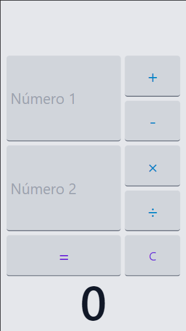
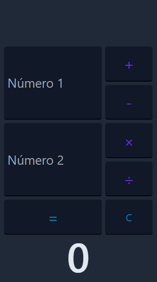

# Calculadora Básica

O seguinte projeto de código visa produzir uma calculadora que execute as operações de soma, subtração, multiplicação e divisão na linguagem de programação JavaScript.

## Funções

- [x] 🔢 Receber dois números.
- [x] ➕ Somar.
- [x] ➖ Subtrair.
- [x] ✖️ Multiplicar.
- [x] ➗ Dividir.
- [x] 🆑 Limpar.
- [x] 🟰 Exibir o resultado.

## Interface

O projeto foi construido inteiramente com a base do conceito "mobile first", sendo responsivo com telas maiores e com disponibilidade de dois temas: claro e escuro.

## Tecnologias

- HTML.
- JavaScript.
- [Tailwind CSS](https://tailwindcss.com/).
- [JQuery](https://jquery.com/).

## Fase de desenvolvimento

A seguinte versão do projeto da calculadora está na fase de desenvolvimento: Concluída ✅.

## Direitos

Todos os direitos reservados © Eyshila Buriti, Fernanda Dantas, Pedro Lucas 2022.
